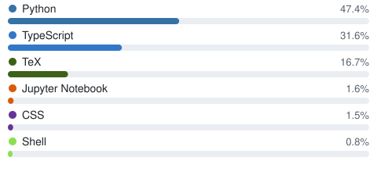

### Hi, I'm Andrei

Computer engineering student. Working on my thesis, *Lost in Quantization*: making quantized LLMs work well for Romanian. I build trading bots, CRMs and automation tools, and my own Claude Code workflow ([skills](https://github.com/zaha27/skills)).

**Interests:** LLM quantization · ML systems · automation · developer tooling

<!-- stats:start -->
| Total Commits | Current Streak | Longest Streak |
|:-:|:-:|:-:|
| 1486 | 1 day | 23 days |
<!-- stats:end -->

**Top languages** (all repos, incl. private)

